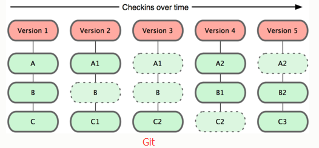
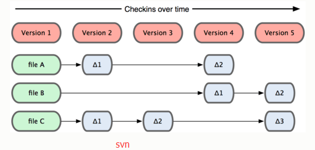
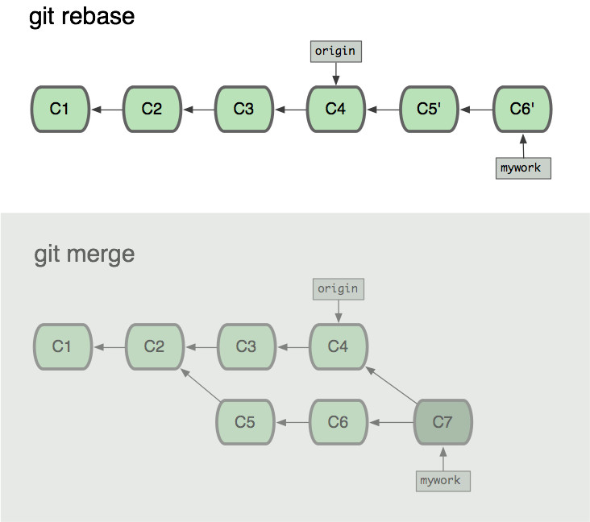
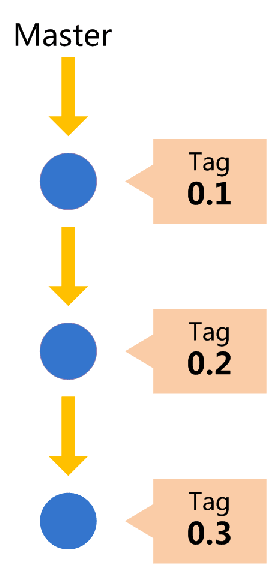
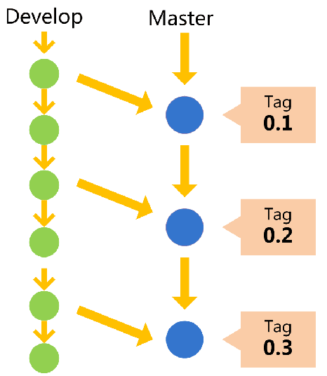
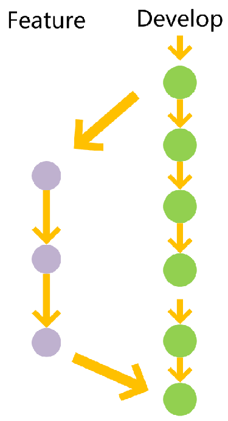
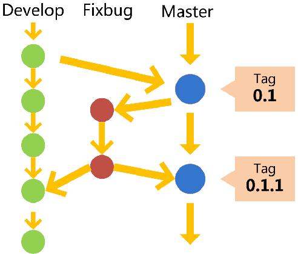

## 一、Git简介

Git是目前世界上最先进的分布式版本控制系统，它是由linux的创始人Linus花两周时间用C语言开发的。主要功能：保存代码文件，保留历史纪录，可以回到过去，多端共享，团队协作

## 二、Git的演变

1985年     CVS       集中式

2000年     SVN       集中式

2005年     Git       分布式

2008年     GitHub    托管网站

## 三. 集中式与分布式比较
1. 集中式版本控制系统
    >版本库集中存放在中央服务器，开发的时候首先要从中央服务器获取最新版本，然后开始开发，开发完成后再把自己的代码推送到中央服务器，缺点是必须联网才能工作。

2. 分布式版本控制系统
    > 分布式版本控制系统没有中央服务器的概念，每个人电脑上都是一个完整的版本库，开发时也不需要联网，本地就存在一个版本库。好处：安全性高

3. 工作方式
    
    Git

    

     Svn

    

## 四、Git的安装
1. Linux(Ubuntu系统为例)
```script
# 第一步：安装git
sudo apt install git

# 第二步：配置
git config --global user.name "test"
git config --global user.email "test@qq.com"
```
2. Mac OS
```script
# 第一步：用homebrew安装, 需首先安装homebrew
homebrew /usr/bin/ruby -e "$(curl -fsSL https://raw.githubusercontent.com/Homebrew/install/master/install)"

# 第二步：安装git
sudo apt install git

# 第三步：配置
git config --global user.name "test"
git config --global user.email "test@qq.com"
```
3. Windows

    第一步：官网下载https://git-scm.com/downloads

    第二步：打开Git Bash

    第三步：配置，如Linux和Mac一致

## 五、Git基础
1. 三种状态: 已提交（committed）、已修改（modified）和已暂存（staged）


2. Git基本命令
```script
# 创建git仓库
git init testgit;

# 创建文件，当前文件是未追踪状态
touch test.txt # 这个不是git命令

# 工作区到暂存区
git add test.txt

# 撤销对文件的修改
git checkout -- test.txt

# 状态查看
git status

# 暂存区到工作区
git rm --cached test.txt
git reset HEAD -- test.txt

# 暂存区到仓库
git commit -m "add test.txt file"

# 历史记录查看
git log #查看全部
git log -3 #查看最近三次提交

# 提交的历史命令查看
git reflog

```

3. Git分支
```script
### 本地分支
# 查看分支
git branch
git branch -v

# 创建分支
git branch testing #创建不切换分支
git checkout -b dev #创建并切换分支

# 切换分支
git checkout testing

# 删除分支
git branch -d testing

```

4. 远程仓库
```script
# 查看远程仓库
git remote -v

# 拉取项目(本地没有仓库)
git clone https://gitlab.com/schuckbeta/testgit.git

# 关联远程仓库(本地已有仓库)
git remote add origin https://gitlab.com/schuckbeta/testgit.git

# 取消关联远程仓库
git remote remove origin

# 推送本地仓库代码到远程仓库
git push origin master

# 拉取不自动合并
git fetch origin
git log -p master..origin/master
git merge origin/master

# 拉取并自动合并
git pull origin master

```

5. 冲突管理
```script
# 从master分支变基
git rebase origin/master

# 继续变基
git rebase --continue

# 终止变基
git rebase --abort
```

    变基概念：


    变基和合并区别：



## 六、分支管理策略
* 主分支master
* 开发develop
* 功能分支feature
* bug分支fixbug

#### 1. 主分支
代码库应该有一个、且仅有一个主分支。所有提供给用户使用的正式版本，都在这个主分支上发布。 Git主分支的名字，默认叫做Master。它是自动建立的，版本库初始化以后，默认就是在主分支在进行开发。 



#### 2. 开发分支
主分支只用来分布重大版本，日常开发应该在另一条分支上完成。我们把开发用的分支，叫做Develop。 这个分支可以用来生成代码的最新代码版本。如果想正式对外发布，就在Master分支上，对Develop分支进行"合并"（merge）



#### 3. 功能分支
功能分支，它是为了开发某种特定功能，从Develop分支上面分出来的。开发完成后，要再并入Develop。 



#### 4. bug分支
bug分支。软件正式发布以后，难免会出现bug。这时就需要创建一个分支，进行bug修补。修补bug分支是从Master分支上面分出来的。修补结束以后，再合并进Master和Develop分支。

