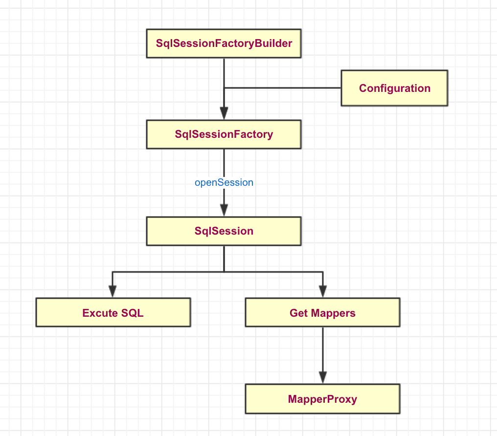
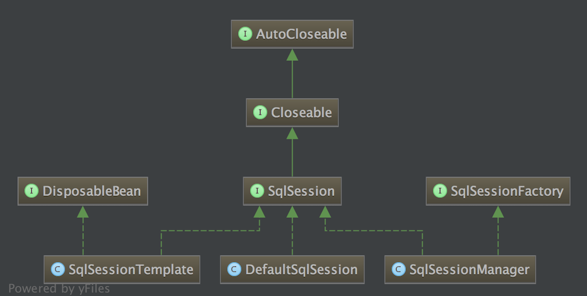

# 一、JDBC、Hibernate

### JDBC(Java Data Base Connectity)

步骤：

* 注册驱动和数据库信息，连接数据库
* 操作Connection, 打开Statement对象
* 通过Statement执行SQL返回结果到ResultSet对象
* 使用ResultSet读取数据，然后通过代码转化为具体的POJO对象
* 关闭数据库相关资源


缺点：
* 工作量大，需要先连接，然后处理JDBC底层事务，处理数据类型。
* 需要对可能产生的异常进行捕捉处理并正确关闭资源


### Hibernate

缺点：
* 全表映射带来的不便，比如更新时需要发送所有的字段
* 无法根据不同条件组装不同的SQL
* 多表关联和复杂SQL查询支持较差
* 不能有效支持存储过程
* 虽然有HQL，但是性能较差，大型互联网系统往往需要优化SQL，而Hibernate做不到。

# 二、Mybatis基本概念

### 基本步骤:

* SqlSessionFactoryBuilder(构造器)：根据配置信息或者代码生成SqlSessionFactory
* SqlSessionFactory: 依赖工厂来生成SqlSession
* SqlSession: 是一个既可以发送SQL去执行并返回结果，也可以获取Mapper的接口
* Sql Mapper: 是Mybatis新设计的组件，它由一个Java接口和XML文件(或注解)构成

    
    

### 详细步骤：
#### 1. 构建SqlSessionFactory

* 代码方式
    ```java
    public SqlSessionFactory createSqlSessionFactory() {
        // 数据库连接池
        PooledDataSource dataSource = new PooledDataSource();
        dataSource.setDriver("com.mysql.jdbc.Driver");
        dataSource.setUrl("jdbc:mysql://localhost:3306/mybatis");
        dataSource.setUsername("root");
        dataSource.setPassword("123456");

        // 数据库事务方式
        TransactionFactory transactionFactory = new JdbcTransactionFactory();

        // 数据库运行环境
        Environment environment = new Environment("development", transactionFactory, dataSource);

        // 创建Configuration对象
        Configuration configuration = new Configuration(environment);

        // 加入一个映射器
        configuration.addMapper(UserMapper.class);

        // 创建SqlSessionFactory
        SqlSessionFactory sqlSessionFactory = new SqlSessionFactoryBuilder().build(configuration);

        return sqlSessionFactory;
    }
    ```
* XML配置(同样可以使用JavaConfig，这里不做介绍)
    
    ```xml
    <?xml version="1.0" encoding="UTF-8"?>
    <!DOCTYPE configuration
            PUBLIC "-//mybatis.org//DTD Config 3.0//EN"
            "http://mybatis.org/dtd/mybatis-3-config.dtd">
    <configuration>

        <!-- 运行环境 -->
        <environments default="development">
            <environment id="development">
                <!-- 配置事务管理 ，采用JDBC管理事务-->
                <transactionManager type="JDBC"/>
                <!-- POOLED是mybatis的 数据源 -->
                <dataSource type="POOLED">
                    <property name="driver" value="com.mysql.jdbc.Driver"/>
                    <property name="url" value="jdbc:mysql://localhost:3306/mybatis"/>
                    <property name="username" value="root"/>
                    <property name="password" value="123456"/>
                </dataSource>
            </environment>
        </environments>

        <!-- 映射器 -->
        <mappers>
            <!-- resource要写成路径 -->
            <mapper resource="com/wu/dao/UserMapper.xml"/>
        </mappers>

    </configuration>
    ```

#### 2. 创建SqlSession

**类继承关系**



在Mybatis中SqlSession接口的实现类主要有两个，分别是DefaultSession和SqlSessionManager。

**它的用途主要有两种：**
* 获取映射器，让映射器通过命名空间和方法名称找到对应的SQL, 发送给数据库执行后返回结果。
* 直接通过命名信息去执行SQL返回结果。

**创建SqlSession代码如下：**

```java
SqlSession sqlSession = null;
try {
    sqlSession = sqlSessionFactory.openSession();
    sqlSession.commit();
} catch (Exception e) {
    e.printStackTrace();
    sqlSession.rollback();
} finally {
    if (null != sqlSession) {
        sqlSession.close();
    }
}
```

#### 3. 映射器

映射器是由Java接口和XML文件(或JavaConfig)共同组成的，主要作用是：

* 定义参数类型
* 描述缓存
* 描述SQL语句
* 定义查询结果和POJO的映射关系


**Mapper**

```java
public interface UserMapper {

    User findByUserId(@Param(value = "userId") Long userId);

}
```

**XML文件实现**

```xml
<?xml version="1.0" encoding="UTF-8" ?>
<!DOCTYPE mapper PUBLIC "-//mybatis.org//DTD Mapper 3.0//EN"
  "http://mybatis.org/dtd/mybatis-3-mapper.dtd" >
<mapper namespace="com.cc.oa.repository.ds1.UserMapper">
  <resultMap id="result" type="com.cc.oa.model.ds1.personalCenter.User">
    <id column="id" property="id" jdbcType="BIGINT"/>
    <result column="open_id" property="openId"/>
    <result column="emp_id" property="empId"/>
    <result column="dept_id" property="deptId"/>
    <result column="company_id" property="companyId"/>
    <result column="role_code" property="roleCode"/>
  </resultMap>
  <sql id="limit">
    <if test="page != null">
      limit #{page.offset} ,#{page.size}
    </if>

  </sql>
  <sql id = "field">
    *
  </sql>
  <select id="findByUserId" resultMap="result" parameterType="Long">
    SELECT
    <include refid="field"/>
    FROM user
    WHERE id = #{userId}
  </select>

</mapper>
```

**Java注解实现**

```java
public interface UserMapper {

    @Select(value = "select * from user where id = #{userId}")
    User findByUserId(@Param(value = "userId") Long userId);

}
```

注解方式针对简单的SQL可以使用，复杂的SQL语句可读性差


# 三、Mybatis配置

### 1. Mybatis配置层次结构(不可颠倒顺序)

```xml
<?xml version="1.0" encoding="UTF-8"?>
<!DOCTYPE configuration
        PUBLIC "-//mybatis.org//DTD Config 3.0//EN"
        "http://mybatis.org/dtd/mybatis-3-config.dtd">
<configuration>
    <!-- 配置 -->
    <properties></properties>
    <!-- 设置 -->
    <settings>
        <setting name="" value=""></setting>
    </settings>
    <!-- 类型命名 -->
    <typeAliases></typeAliases>
    <!-- 类型处理器 -->
    <typeHandlers></typeHandlers>
    <!-- 对象工厂 -->
    <objectFactory type=""></objectFactory>
    <!-- 插件 -->
    <plugins>
        <plugin interceptor=""></plugin>
    </plugins>
    <!-- 配置环境 -->
    <environments default="">
        <!-- 环境变量 -->
        <environment id="">
            <!-- 事务管理器 -->
            <transactionManager type=""></transactionManager>
            <!-- 数据源 -->
            <dataSource type=""></dataSource>
        </environment>
    </environments>
    <!-- 数据库厂商标识 -->
    <databaseIdProvider type=""></databaseIdProvider>
    <!-- 映射器 -->
    <mappers></mappers>
</configuration>
```

# 四、Mybatis解析和运行原理

## 1. 加载配置文件

## 2. 创建SqlSessionFactory

* 创建Configuration对象并初始化(XMLConfigBuilder)
* 映射器的解析(XMLMapperBuilder)
* 构建SqlSessionFactory

## 3. 运行SqlSession